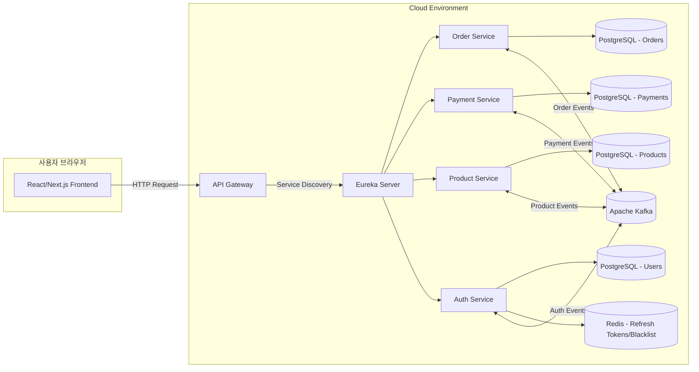

# 🛒 Order & Payment System (MSA 기반)

MSA 구조와 이벤트 기반 아키텍처를 학습하기 위해 진행한 개인 프로젝트입니다.
실제 쇼핑몰 환경을 간단히 모델링하여 주문, 결제, 상품, 인증 기능을 마이크로서비스로 분리하고,
서비스 간 통신은 Kafka 이벤트 스트리밍을 활용했습니다.

운영 목적보다는 **MSA 설계, 서비스 간 데이터 흐름, 장애 복구 패턴(Saga)**을 직접 구현·실습하는 것에 초점을 두었습니다.
---


---

## 📌 아키텍처 개요 (MSA 구조)
이 프로젝트는 다음과 같은 **마이크로서비스** 로 구성됩니다:

1️. **Auth Service (인증 서비스)**
- JWT 기반 인증 및 사용자 관리
- 역할(Role) 기반 접근 제어 (`BUYER`, `SELLER`)
- Kafka를 이용한 `SELLER` 및 `BUYER` 정보 전송 (Event-Driven)

2️. **Order Service (주문 서비스)**
- 상품 주문 관리
- 구매자(`BUYER`) 및 판매자(`SELLER`) 정보 캐싱
- 주문 데이터 저장 및 상태 관리

3️. **Payment Service (결제 서비스)**
- 결제 요청 및 승인 처리
- 주문 상태 변경 (`ORDERED` → `PAID`)
- Kafka를 이용한 결제 이벤트 처리

4. **API Gateway (게이트웨이 서비스)**
- Spring Cloud Gateway를 사용하여 API 요청을 라우팅
- JWT 인증 및 보안 필터 적용

5. **Product Service(제품 서비스)**
- 판매 제품 관리
- 재고 관리

---

## ⚙️ 사용 기술 스택
| 분야            | 기술 스택 |
|---------------|-----------------|
| **Language**  | Java 17, Spring Boot |
| **Frameworks**  | Spring Security, Spring WebFlux, Spring Kafka |
| **Database**   | MySQL, Redis |
| **Message Queue** | Apache Kafka |
| **API Gateway** | Spring Cloud Gateway |
| **Real-time**   | Kafka Streams |
| **Authentication** | JWT (JSON Web Token) |
| **DevOps**      | Docker |

---

## 🏗️ 서비스 간 데이터 흐름
### 🔹 Kafka 기반 이벤트 흐름
- **사용자 정보 전송 (Auth → Order, Payment)**
    - `auth-service` → `order-service` 로 `SELLER`, `BUYER` 정보 전달
    - `auth-service` → `payment-service` 로 `BUYER` 정보 전달

- **주문 및 결제 처리**
    - `order-service` → `payment-service` 로 결제 요청 이벤트 발행
    - `payment-service` → `order-service` 로 결제 완료 이벤트 발행

- **결제 흐름**
    - 주문 생성 → Kafka 이벤트 발행 → 결제 서비스 소비 → 결제 승인/실패 이벤트 → 주문 상태 업데이트
    - 주문 상태는 CREATED, PAID, CANCELLED 흐름을 지원
    - 결제 실패 시 Saga 패턴 기반으로 주문 취소(보상 트랜잭션) 수행
```mermaid
sequenceDiagram
    participant User as 사용자(프론트엔드)
    participant GW as API Gateway
    participant ORS as Order Service
    participant KAFKA as Kafka Broker
    participant PAS as Payment Service

    User->>GW: 주문 요청 (상품ID, 수량)
    GW->>ORS: 주문 생성 요청
    ORS->>ORS: 주문 상태 = CREATED
    ORS->>KAFKA: OrderCreated 이벤트 발행

    KAFKA->>PAS: OrderCreated 이벤트 소비
    PAS->>PAS: 결제 승인/실패 처리
    PAS->>KAFKA: PaymentResult 이벤트 발행

    KAFKA->>ORS: PaymentResult 이벤트 소비
    alt 결제 성공
        ORS->>ORS: 주문 상태 = PAID
    else 결제 실패
        ORS->>ORS: 주문 상태 = CANCELLED (Saga 보상 트랜잭션)
    end
    ORS-->>GW: 주문 최종 상태 응답
    GW-->>User: 결제 결과 화면 표시
    end
```

---

## 🔑 보안 및 인증 (Auth Service)
- JWT 기반 **토큰 인증** 적용
- Spring Security + API Gateway에서 **권한(Role) 기반 접근 제어**
- `SELLER` 와 `BUYER` 의 권한을 Enum 클래스로 정의하여 관리
- `BUYER` 정보는 구매한 `SELLER` 에 대해서만 조회 가능하도록 제한

---

## 🚀 주요 학습 포인트
### 🔹 API Gateway & JWT 인증
- 게이트웨이 필터에서 JWT 인증/인가 처리
- 만료된 토큰은 Redis 저장소 기반으로 자동 재발급

### 🔹 Kafka 이벤트 기반 통신
- 주문과 결제를 비동기 이벤트로 연결
- Saga 패턴을 적용하여 결제 실패 시 주문 자동 취소 처리

### 🔹 MSA 구조 설계 경험
- 서비스 간 결합도를 낮추고 독립 배포 가능하도록 설계
- 멀티 클라우드 배포를 통해 클라우드 환경 차이를 비교 학습
  
---

## 📜 한계와 개선
- 실운영 목적이 아닌 학습용이라, 모니터링·테스트·보안 등 운영 품질 요소는 최소화했습니다.
- 주문/결제 도메인은 단순화했으며, 실제 상용 쇼핑몰 수준의 복잡한 기능(환불, 배송 관리 등)은 포함하지 않았습니다.c
- 추후 개선 포인트: Testcontainers 기반 통합 테스트, Grafana 모니터링, CQRS 적용

---

## 📌 기여 가이드
1. 코드 스타일은 [Google Java Style Guide](https://google.github.io/styleguide/javaguide.html) 준수

---

## 💬 문의 및 피드백
- **GitHub Issues** 에 피드백 남겨주세요!
- **Email:** lenac115@naver.com  
